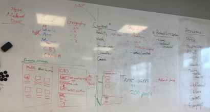

# Humanitarian Opportunity Explorer (HOpE)
>The Humanitarian Opportunity Explorer provides a compact, easy-to-use tool for people to share Opportunities (tools, approaches, or other resources) with the wide set of colleagues in the Red Cross Red Crescent and with other humanitarian and development partners. The primary goal is to support initial discovery, by presenting a wide range of opportunity and enabling fast, responsive filtering and searching. Links in the cards then guide the user to other sites and information where more information is available. The explorer is meant to capture both established Opportunities and new ones that are in various stages of ideation, prototyping, or development.
>
>You can see a running version of the site at [1bc4resilience.github.io/HOpE](https://1bc4resilience.github.io/HOpE/).
>
>Similar sites have been created in the past *[examples to be added]*. We will reach out to learn more about the lessons from those efforts and how we might maximize the utitility of the current or new versions of the explorer.

1. **Project team:**
   > The Humanitarian Opportunity Explorer has been built as part of the collaboration on **Digital and Data Transformation** being under taken by the network of the **International Federation of Red Cross and Red Crescent Societies** ([IFRC](http://www.ifrc.org)).
   >
   > The explorer builds on:
   >   + an initial suggestion from the British Red Cross 
   >   + a design session held with the Norwegian Red Cross, British Red Cross, and DNV GL, a corporate partner to the Norwegian Red Cross
   >
   >     
   >   + inspiration from a similar [Global Opportunity Explorer](https://goexplorer.org) built by DNV GL and other corporate partners

1. **Features:**
   + provides taster menu to highlight different opportunities and then steers users off to relevant sites for more information
   + content is user generated and collected via Google form
   + responsive site that works well on mobile

1. **Base:**
   + The project builds substantially on [Shuffle](https://vestride.github.io/Shuffle) project on Github.
   + There is also a little bit of html & css from Microsoft Dynamics 365 used for the hidden Intro section.

1. **Future state:**
   1. In the future the explorer could be hosted on another site (e.g. with the IFRC.org or PrepareCenter.org sites) or with with dedicated domain name. The current version is intended as a prototype to test user interest and utility and to begin to build a solid set of relevant Opportunities.
   1. The current usage of Google Sheets and Google forms could be changed to use the IFRC’s Kobo form and server service instead.
   1. Integreate two new feature sets: a) a **filter by user / stakeholder** and b) a **gap analysis** feature to show where existing tools and opportunities contribute and where gaps still exist.

1. **New features to potentially add:**
   1. fix minor bug so that the search still works when filters are selected
   1. consider change responsive seetings for mobile view in profile to be 1 column instead of 2 column (this would also allow use of both larger text and additional text for description)
   1. add progressive loading (as the user scrolls) as the number of Opportunities increases [otherwise the loading the images will slow initial use]
   1. consider using service to reduce image sizes as number of Opportunities increases
   1. enable translation into multiple languages (using Google translate to translate card inputs from initial language to target langue)
   1. enable sharing by social media (e.g. as cards on Twitter)
   1. enable people to share search terms (e.g. through URL parameters)

[IFRC Solutions Matrix](https://docs.google.com/spreadsheets/d/1K97dqpwiB_ipHvahS3F3sJDaX7qgzrsUWVxPbhOFsPE/edit#gid=0&fvid=933206192)
